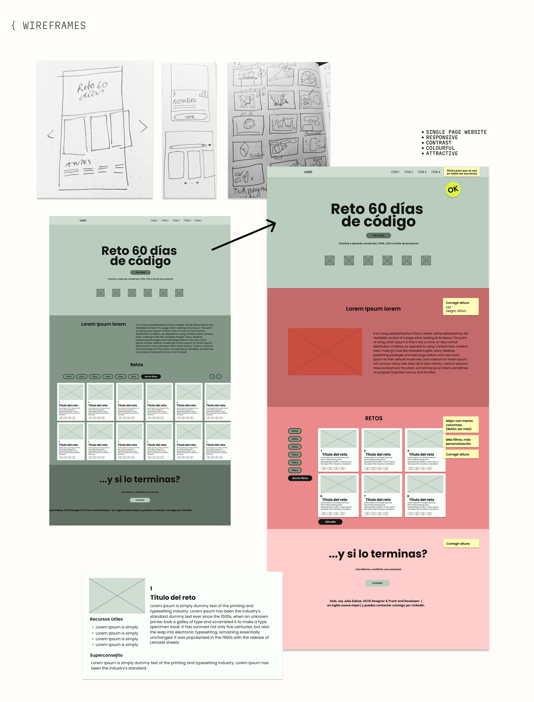

# 🚀 Reto 60 Días de Código

Este proyecto es el resultado del **Reto 60 Días de Código** propuesto por **[Matías Cukier]**, y representa una experiencia completa en la que puse en práctica mis conocimientos como **Frontend Developer**, **UX/UI Designer** y **Product Designer**.

La plataforma recopila los **60 retos del desafío**, junto con **recursos y documentación** que facilitan el aprendizaje progresivo.  
Cada proyecto incrementa su nivel de dificultad y refuerza habilidades clave en:

- **HTML, CSS, JavaScript**
- **React**
- **Consumo de APIs**
- **Buenas prácticas de desarrollo**

---

## 🌟 Visión de producto  
Este proyecto fue concebido y desarrollado con un enfoque **end-to-end**, abarcando todas las fases del ciclo de diseño y desarrollo:  


- 🔍 **Investigación e ideación** de la experiencia  
- 📝 **Wireframes y prototipado** para validar flujos  
- 🎨 **Diseño de interfaz (UI)** e ilustraciones propias  
- ⚡ **Optimización de la experiencia de usuario (UX)**  
- 💻 **Implementación técnica** con un stack moderno de frontend  

👉 Gracias a ello, el proyecto refleja la capacidad de **concebir, diseñar y construir un producto digital completo**.  


---
## 🛠️ Características principales

- 🎯 **60 retos** con explicación detallada, recursos útiles con tutoriales y documentación además de consejos.
- 🗂 **Filtrado por tecnología** (HTML, CSS, JavaScript, React, Node.js, APIs, etc.).
- 📈 **Vista progresiva** de retos (cargar más / mostrar menos).
- 📱 **Diseño responsive** y optimizado para móviles.
- 💡 **Modal interactivo** para ver cada reto con más detalle.
- 🎨 **Estilos personalizados** y uso de imágenes y logos de tecnologías.

---

## 🚀 Tecnologías utilizadas

- [React 19](https://react.dev/)
- [Vite](https://vitejs.dev/)
- [React Router DOM](https://reactrouter.com/)
- [PropTypes](https://www.npmjs.com/package/prop-types)
- [ESLint + Prettier](https://eslint.org/)
- [Figma](https://www.figma.com/)


## 🚀 Instalación y uso

1. **Clonar el repositorio**
```bash
   git clone https://github.com/Julia-SP/web_60_dias_codigo.git
   cd web_60_dias_codigo
 ```
2. **Instalar dependencias**
```bash
    npm install
```
3. **Modo desarrollo**
```bash
    npm run dev
```
4. **Build de producción**
```bash
    npm run build
```
5. **Vista previa del build**
```bash
    npm run preview
```
## ▶️ Uso


Explica cómo usar el proyecto después de ejecutarlo. Incluye ejemplos o comandos adicionales si aplica.

---

## ✨ Funcionalidades
- Galería de retos con filtros y paginación

- Visualización en detalle con modal interactivo

---

## 📂 Estructura del proyecto

WEB_60_DIAS_CODIGO/
├── data/
│ └── data_retos.js # Array con la información de los 60 retos (nombre, descripción, tecnologías, enlaces, etc.)
│
├── node_modules/ # Dependencias instaladas con npm (se genera automáticamente)
│
├── public/
│ ├── assets_retos/ # Imágenes de los retos (capturas, miniaturas)
│ ├── logos_tools/ # Logos de tecnologías (HTML, CSS, JS, React, Node.js, APIs, etc.)
│ ├── favicon_60.svg # Favicon principal del proyecto
│ ├── LOGO_60_blanco.svg # Variaciones del logo del reto
│ ├── LOGO_60_morado.svg
│ ├── LOGO_60_negro.svg
│
├── src/
│ ├── App.jsx # Componente raíz de la aplicación
│ ├── FichaReto.jsx # Componente que muestra la información completa de un reto en modal
│ ├── Footer.jsx # Pie de página
│ ├── Hero.jsx # Sección inicial con título, botón y logos
│ ├── main.jsx # Punto de entrada que monta la app en el DOM
│ ├── NavBar.jsx # Barra de navegación principal
│ ├── Section_1.jsx # Sección explicativa "What the hell is this?"
│ ├── Section_2.jsx # Galería de retos con filtros y paginación
│ ├── styles_fichaReto.css # Estilos del componente FichaReto
│ ├── styles_footer.css # Estilos del Footer
│ ├── styles_hero.css # Estilos de la sección Hero
│ ├── styles_navBar.css # Estilos de la barra de navegación
│ ├── styles_Section.css # Estilos de las secciones 1 y 2
│ ├── styles_tarjeta_reto.css # Estilos de las tarjetas de reto
│ ├── styles.css # Estilos generales/globales
│ └── Tarjeta_reto.jsx # Componente individual para mostrar un reto en la galería
│
├── .gitignore # Archivos y carpetas que Git debe ignorar
├── .prettierrc # Configuración de Prettier (formateador de código)
├── eslint.config.js # Configuración de ESLint para análisis estático del código
├── index.html # HTML base donde se inyecta la app de React
├── package-lock.json # Versión exacta de dependencias instaladas
├── package.json # Configuración del proyecto, scripts y dependencias
├── README.md # Documentación principal del proyecto
└── vite.config.js # Configuración de Vite para el bundling y desarrollo


### 📌 Resumen de carpetas clave

- **`data/`** → Contiene la información de todos los retos, separada de los componentes para fácil mantenimiento.  
- **`public/`** → Archivos estáticos accesibles directamente por el navegador (imágenes, logos, favicon).  
- **`src/`** → Código fuente de la aplicación (componentes React y estilos).  
- **Archivos raíz** → Configuraciones, dependencias y documentación del proyecto.

---
## 📷 Wireframes y diseño

---
## 🎥 Demo del proyecto


---
## 📄 Licencia


Este proyecto es de uso libre bajo las siguientes condiciones:

+ El código puede ser utilizado, modificado y distribuido con fines personales o educativos.

+ Las ilustraciones, imágenes y logos NO están cubiertos por esta licencia y no pueden ser reutilizados sin autorización.

+ Debe mencionarse siempre la autoría:

Proyecto creado por Julia Subiza (https://github.com/Julia-SP) como parte del Reto 60 Días de Código.
LinkedIn: https://www.linkedin.com/in/juliasubiza/


---

